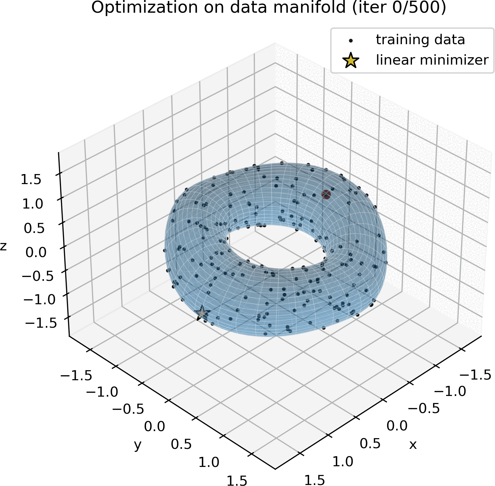
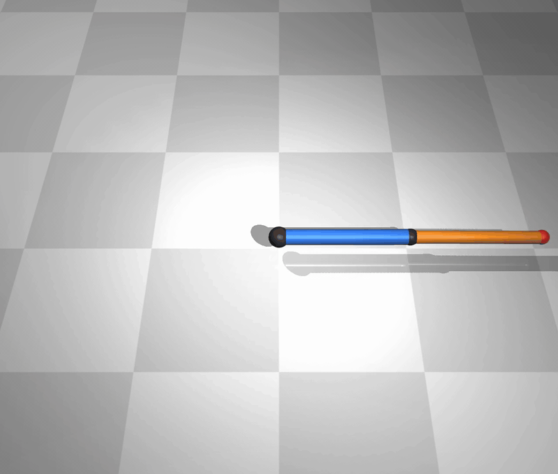
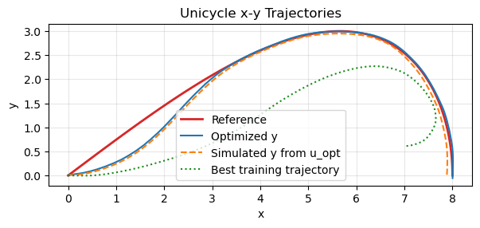

# Score Manifold Optimization

<p align="center">
  
  
</p>

Repository for the paper

<div align="center">

[**Landing with the Score: Riemannian Optimization through Denoising**](https://openreview.net/forum?id=xZNoeX0z9f),

A. Kharitenko, Z. Shen, R. de Santi, N. He, and F. Dörfler  
*Fourteenth International Conference on Learning Representations (ICLR 2026), 2026.*

</div>

This repository contains methods for

- score-based diffusion model training,
- Optimization using denoising Riemannian gradient descent (DRGD) and denoising landing flow (DLF),
- Tools for reference-tracking control using DRGD

## Links

- Paper: [`Arxiv`](https://arxiv.org/abs/2509.23357), [`OpenReview`](https://openreview.net/forum?id=xZNoeX0z9f), [`ICLR 2026`](https://iclr.cc/virtual/2026/poster/10006634)
- Project website: [`https://completemetricspace.github.io/score-manifold-optimization-webpage/`](https://completemetricspace.github.io/score-manifold-optimization-webpage/)
- Release assets (checkpoints + datasets): [`https://github.com/CompleteMetricSpace/score-manifold-optimization/releases`](https://github.com/CompleteMetricSpace/score-manifold-optimization/releases)

## Install

Recommended: Python 3.10+.

```bash
pip install -e .
```

This repository is API-first; examples below use direct Python library calls.

Optional MuJoCo support:

```bash
pip install -e .[mujoco]
```

## Examples

### 1. Create a tiny dataset from the Stiefel manifold St(3,3)

```python
from pathlib import Path
from diffusion.data import generate_dataset
from diffusion.spaces import Stiefel

Path("data").mkdir(parents=True, exist_ok=True)
generate_dataset(
    generator_type="manifold",
    constraint=Stiefel(n=3, p=3),
    n_train=2000,
    n_test=400,
    n_val=200,
    save_path="data/stiefel_n3_p3.pt",
)
```

### 2. Train a score model

```python
from pathlib import Path
import torch
import yaml
from diffusion.data import load_dataset
from diffusion.models import create_model
from diffusion.training import (
    DiffusionTrainer,
    TrainingOptions,
    create_diffusion,
    create_optimizer,
)

device = "cpu"
with open("configs/train_stiefel_quick.yaml", "r", encoding="utf-8") as f:
    cfg = yaml.safe_load(f)

dataset = load_dataset(cfg["dataset"]["path"], reconstruct_constraint=True, device=device)
space = dataset.get_space()
diffusion = create_diffusion(space, cfg)
model = create_model(
    model_type=str(cfg["model"]["type"]),
    space=space,
    diffusion=diffusion,
    config=cfg,
    initialize=True,
).to(device)
optimizer = create_optimizer(model, cfg)

options_dict = dict(cfg.get("training_options", {}))
options_dict["batch_size"] = int(cfg.get("training", {}).get("batch_size", 32))
options = TrainingOptions(**options_dict)
output_dir = Path("outputs/stiefel_train_demo")
output_dir.mkdir(parents=True, exist_ok=True)

constraint = dataset.constraint
def log_fn(samples):
    v = constraint.violation(samples)
    return {"constraint_violation_mean": float(v.mean().item())}

trainer = DiffusionTrainer(
    diffusion=diffusion,
    score_model=model,
    train_data=dataset.train_data.to(device),
    optimizer=optimizer,
    options=options,
    log_fn=log_fn,
    device=device,
    output_dir=output_dir,
    metadata=dataset.metadata,
)
trainer.train(num_epochs=int(cfg.get("training", {}).get("num_epochs", 100)))
trainer.save_checkpoint(str(output_dir / "checkpoint.pt"))
```

### 3. Run DRGD optimization

```python
import torch
from diffusion.optimization import (
    RiemannianConfig,
    ScoreTangentConfig,
    build_score_projector,
    run_riemannian_optimization,
)
from diffusion.utils.checkpoint_utils import load_pretrained_score_context

device = torch.device("cpu")
ctx = load_pretrained_score_context(
    checkpoint_dir="outputs/stiefel_train_demo",
    dataset_path_override="data/stiefel_n3_p3.pt",
    device=device,
)
train_data = ctx.train_data

# Brockett objective (batched): f(x) returns shape (B,)
n, p = train_data.shape[-2], train_data.shape[-1]
Q = torch.eye(n, device=device, dtype=train_data.dtype)
K = torch.diag(torch.arange(1, p + 1, device=device, dtype=train_data.dtype))
def objective_fn(x: torch.Tensor) -> torch.Tensor:
    xtqx = x.transpose(1, 2) @ Q @ x
    return torch.einsum("bij,ji->b", xtqx, K)

# Custom objective: replace objective_fn with any batched f(x)->(B,).
# If you have an explicit gradient, pass it as grad_objective_fn=...
x0 = train_data[:1].detach().clone()
projector = build_score_projector(
    score_model=ctx.model,
    diffusion=ctx.diffusion,
    score_time=0.1,
    data_dims=train_data.shape[1:],
    n_proj=1,
    tangent_cfg=ScoreTangentConfig(method="jvp"),
)
cfg = RiemannianConfig(step_size=5e-3, n_steps=200, tangent_mode="projector")
result = run_riemannian_optimization(
    x0=x0,
    objective_fn=objective_fn,
    grad_objective_fn=None,
    projector=projector,
    cfg=cfg,
)
```

### 4. Run reference-tracking control using DRGD (trajectory model)

Note that trajectories are represented by tensors of shape ```(B, T, D)```, where ```B``` is the batch dimension, ```T``` is the trajectory time horizon and ```D = U + Y``` is the dimesion (input-dimension + output dimension).

```python
import torch
from diffusion.control import build_reference_tracking_objective, run_reference_tracking
from diffusion.optimization import RiemannianConfig, ScoreTangentConfig, build_score_projector
from diffusion.utils.checkpoint_utils import load_pretrained_score_context

device = torch.device("cpu")
ctx = load_pretrained_score_context(
    checkpoint_dir="outputs/unicycle_train_demo",
    dataset_path_override="data/unicycle_T100_n20000.pt",
    device=device,
    require_trajectory_data=True,
)
train_data = ctx.train_data
constraint = ctx.constraint

reference_idx = 0
reference = train_data[
    reference_idx : reference_idx + 1,
    :,
    constraint.input_dim : constraint.input_dim + constraint.output_dim,
]  # or any custom reference tensor with shape (1, T, output_dim)

slice_spec = slice(constraint.input_dim, constraint.input_dim + constraint.output_dim)
objective_fn = build_reference_tracking_objective(reference_trajectory=reference, slice_spec=slice_spec)

# External x0 selection by objective argmin on train_data
with torch.no_grad():
    best_idx = int(torch.argmin(objective_fn(train_data)).item())
x0 = train_data[best_idx : best_idx + 1].detach().clone()

projector = build_score_projector(
    score_model=ctx.model,
    diffusion=ctx.diffusion,
    score_time=0.3,
    data_dims=train_data.shape[1:],
    n_proj=1,
    tangent_cfg=ScoreTangentConfig(method="jvp"),
)
cfg = RiemannianConfig(step_size=2e-2, n_steps=100, tangent_mode="projector")
tracking = run_reference_tracking(
    reference_trajectory=reference,
    slice_spec=slice_spec,
    projector=projector,
    cfg=cfg,
    x0=x0,
)
```
<p align="center">
 
</p>

## Colab Notebooks

This repo contains more examples in notebook form:

- [examples/colab/01_stiefel_train.ipynb](examples/colab/01_stiefel_train.ipynb)
- [examples/colab/02_stiefel_optimize.ipynb](examples/colab/02_stiefel_optimize.ipynb)
- [examples/colab/03_unicycle_train.ipynb](examples/colab/03_unicycle_train.ipynb)
- [examples/colab/04_unicycle_control.ipynb](examples/colab/04_unicycle_control.ipynb)
- [examples/colab/05_robot_arm_train.ipynb](examples/colab/05_robot_arm_train.ipynb)
- [examples/colab/06_robot_arm_control.ipynb](examples/colab/06_robot_arm_control.ipynb)


## Optional MuJoCo Adapter

If you want to use a MuJoCo robot directly in the workflow:

```python
from diffusion.control.mujoco import MuJoCoSystem
from diffusion.data import DynamicsDataGenerator

system = MuJoCoSystem("robot.xml", dT=0.002, Ts=0.02)
generator = DynamicsDataGenerator(system=system, horizon=100)
trajectories = generator.generate(256)
```

Current adapter assumptions:
- output is full state `y = [qpos, qvel]`
- model has no actuator activation state (`model.na == 0`)

### Using an External Pre-trained Score Model

Recommended path: wrap the Diffusers model into `ScoreProjector` callables
(`score_fn`, `mean_coef_fn`, `var_fn`) and use the library DRGD functions.

```python
import torch
from diffusers import UNet2DModel, DDPMScheduler
from diffusion.optimization import ScoreProjector, RiemannianConfig, run_riemannian_optimization

# Example DDPM model + scheduler from Diffusers
unet = UNet2DModel.from_pretrained("google/ddpm-cifar10-32").eval()
sched = DDPMScheduler.from_pretrained("google/ddpm-cifar10-32")
alphas_bar = torch.tensor(sched.alphas_cumprod)
N = len(alphas_bar)

def t_to_k(t):  # map t in [0,1] to discrete timestep index
    return (t.clamp(0, 1) * (N - 1)).round().long()

def mean_coef_fn(t):
    return torch.sqrt(alphas_bar[t_to_k(t)]).to(t.device, t.dtype)

def var_fn(t):
    return (1.0 - alphas_bar[t_to_k(t)]).to(t.device, t.dtype)

def score_fn(t, x):
    k = t_to_k(t)
    eps = unet(x, k).sample               # epsilon prediction
    sigma = torch.sqrt(var_fn(t)).view(x.shape[0], *([1] * (x.ndim - 1)))
    return -eps / sigma.clamp_min(1e-8)  # convert epsilon -> score

projector = ScoreProjector(
    score_fn=score_fn,
    mean_coef_fn=mean_coef_fn,
    var_fn=var_fn,
    score_time=0.1,
    data_ndim=3,  # for image tensors [B, C, H, W]
    n_proj=1,
)
cfg = RiemannianConfig(step_size=5e-3, n_steps=200, tangent_mode="projector")
result = run_riemannian_optimization(x0, objective_fn, None, projector, cfg)  # x0/objective_fn: your problem
```

For checkpoint interoperability, package artifacts in this repo’s checkpoint format:

- `model.pth`
- `checkpoint_data.pt`
- `config.yaml`
- `metadata.json`

What must match:
- model output must be a score on the same ambient tensor space as your variable
- `mean_coef_fn` / `var_fn` must match the model’s training noising process
- tensor shapes, dtype, and device must be consistent across model/projector/objective

## Dataset Format

Datasets are `.pt` files created with `torch.save` and should contain:

```python
{
  "train_data": Tensor,                  # required, shape [B, ...]
  "test_data": Tensor,                   # optional
  "val_data": Tensor,                    # optional
  "metadata": {                          # required
    "space": {"class": "...", "params": {...}},      # required
    "constraint": {"class": "...", "params": {...}}  # optional (or null)
  }
}
```

Notes:
- `train_data` is required.
- `metadata.space` must match the tensor shape.
- `constraint` is optional for training, but useful for logging and verifying constraint violations when a model is available.

## Canonical Checkpoint Files

Each training output directory should contain:
- `model.pth`: model weights (`state_dict`)
- `checkpoint_data.pt`: training state (epoch/step/optimizer/options)
- `config.yaml`: resolved training config
- `metadata.json`: metadata snapshot
